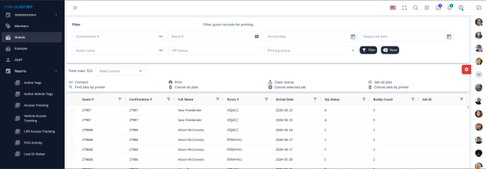

# Introduction 
This project creates an centralized service to manage different types of printers (i.e. USB or network printers) available in an organisation to be able to submit a print from a browser or any websocket client.

This application manages multiple printers connected to a network at the same time and sends jobs designated to respective printer as they become available to pick next job in a queue.

e.g. If all of the below jobs are submitted in one shot.

- Job 1 - Printer A
- Job 2 - Printer A
- Job 3 - Printer A
- Job 4 - Printer B
- Job 5 - Printer B
- Job 6 - Printer C

Printer A will pick Job 1 -> 2 -> 3 as it becomes available. Similarly rest of the printers work in parallel based on their queue.

## Core components

1. [Worker service](PrinterService/Worker.cs)
2. [JobManager](PrinterService/JobManager.cs)
3. [PrinterManager](PrinterService/PrinterManager.cs)
4. [PrinterWorker](PrinterService/PrinterWorker.cs)
5. [AbstractPrinter](Devices/Printers/AbstractPrinter.cs)


#### Worker service
It calls ProcessJobAsync in an infinite loop with a delay of 3 seconds
```
while (!stoppingToken.IsCancellationRequested)
{
    using (LogContext.PushProperty(Constants.Hub, nameof(PrintHub)))
    {
        await _jobManager.ProcessJobAsync();
        // Background processing, e.g., managing print jobs
        await Task.Delay(3000, stoppingToken); // Example delay
    }
}
```


#### JobManager
It's a singleton object which manages all the jobs in thread safe ConcurrentDictionary.
```
public interface IJobManager
{
    Task<PrintJob> CreateJob(SubmitJobDto input, string connectionId, string userId, string correlationId);
    Task ProcessJobAsync();
    Task CancelJobAsync(string jobId);
    Task CancelAllJobs(string printerId);
    Task ChangePrinterAsync(string jobId, string newPrinterId);
    Task<Dictionary<string, PrintJob>> GetSubmittedJobs(string printerId);
    Task<Dictionary<string, string>> GetPrinterStatus(string printerId);
}
```

#### PrinterManager
Manages onboarding and offboarding of printers. These printers can be network printers or USB printers. As long as they abide to the contract of AbstractPrinter class it can be managed by PrinterManager. PrinterManager holds singleton object of each printer(_printers) so as to ensure no more than one instance of printer gets created.

```
public static ConcurrentDictionary<string, PrinterWorker> GetAllPrinters();

public async static Task<PrinterWorker> AddPrinter(string printerId, PrinterSettings settings);

public static PrinterWorker GetPrinter(string printerId);

public bool IsPrinterAvailable(string printerId);
```

#### PrinterWorker
This is a physical printer instance which exposes methods for printing, notification, Before and After Print actions

#### AbstractPrinter
Methods implemented by physical printer libraries like connect, disconnect, print, printer status etc.


### Working

As soon as application is launched, it runs in a background. In the background a websocket is created to listen for any upcoming requests. `IPrintHub` exposes all of the methods currently exposed by Web socket.

Here is the class [PrintHub.cs](PrinterService/PrintHub.cs) which exposes these methods.
```
public interface IPrintHub
{
    Task<string> SubmitPrintJob(SubmitJobDto input);

    Task CancelJob(string jobId, string correlationId =null);

    Task CancelAllJobs(string correlationId = null);

    Task ChangePrinter(string jobId, string newPrinterId, string correlationId = null);

    Task<Dictionary<string, PrintJob>> GetSubmittedJobs(string printerId, string correlationId = null);

    Task<Dictionary<string, string>> GetPrinterStatus(string printerId, string correlationId = null);
}
```

Using `SubmitPrintJob`, we can submit the job for printing. Contract details are available in the same file [SubmitJobDto.cs](Devices/Model/SubmitJobDto.cs)

Below is a screenshot of various methods exposed from signalR to control the job processing.
[SignalR client - Web based](SignalR.html)


Project in action
